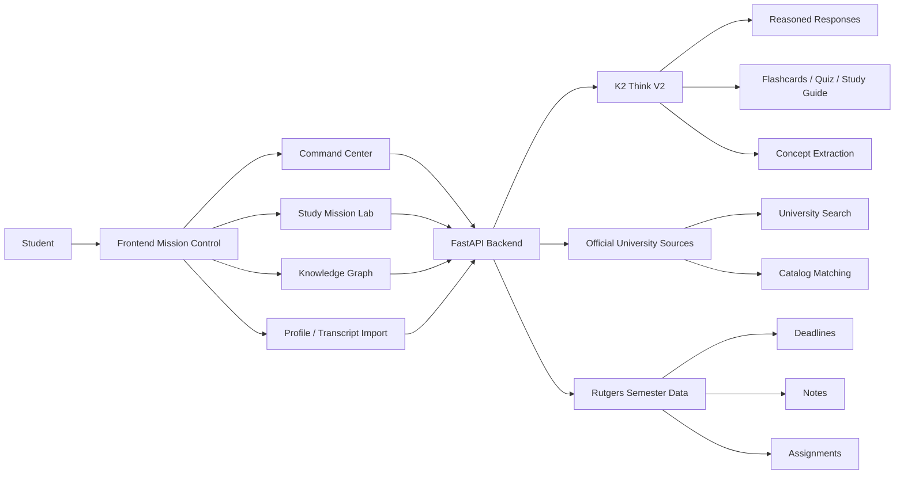

# Syllara

<div align="center">
  
</div>

<div align="center">

### Rutgers-First Academic Mission Control

Syllara turns a student's fragmented semester into a live reasoning system.

[](#)
[](#why-k2-think-v2)
[](#why-it-matters)
[](#track-fit)

</div>

---

## The Pitch

Students do not fail because information is missing.

They fail because their semester is scattered across too many places:
- LMS pages
- assignment PDFs
- syllabi
- lecture notes
- mental to-do lists

Syllara is the layer above all of that.

It acts like an academic mission-control system that:
- identifies what is actually urgent
- explains why a task matters
- traces concept weaknesses before they become deadline problems
- generates targeted study artifacts from real course context
- scales from one school to many using official university sources

This is not a generic chatbot.  
This is a reasoning interface for academic survival.

---

## Why It Matters

We built Syllara for Rutgers graduate CS students first because that user is overloaded, high-context, and constantly switching between theory, systems, ML, and project work.

That makes Rutgers the ideal proving ground.

Once the workflow works there, it scales:
- from one semester to the full degree
- from one student to advising and tutoring teams
- from Rutgers to other universities through official catalogs and transcript ingestion

---

## Why Judges Should Care

Most student AI tools stop at:
- chat
- summary
- note cleanup

Syllara goes further:
- it reasons over the full semester state
- it surfaces risk before the student asks
- it ties recommendations to actual courses and assignments
- it converts weak understanding into drills, quizzes, and study guides
- it is structured for institutional expansion, not just a demo prompt

The result feels less like “an LLM app” and more like a real academic operating system.

---

## Core Experience

### 1. Command Center
The student opens one screen and immediately sees:
- what is at risk
- what is due soon
- what concept gaps are causing those risks
- what to do next

### 2. Knowledge Graph
Syllara maps concepts across courses and tracks mastery, so weak spots are visible instead of hidden until exam week.

### 3. Study Mission Lab
From any topic, the student can generate:
- flashcards
- quizzes
- study guides

These are not generic outputs. They are grounded in the course and semester context.

### 4. Transcript + University Ingestion
Students can:
- search universities
- pull official university identity data
- import transcripts
- match transcript lines against official catalog entries

That is what makes this product extensible beyond a fixed mock demo.

---

## Why K2 Think V2

K2 Think V2 is not a side feature in Syllara. It is the engine.

We use K2 for:
- multi-step semester-aware chat
- study guide generation
- flashcard generation
- quiz generation
- concept extraction into the knowledge graph
- scoped topic reasoning for deep-dive help

K2 is central because the product depends on sustained reasoning across many moving parts:
- deadlines
- course context
- graph structure
- remediation state
- imported academic history

That makes Syllara a strong fit for **Best Use of K2 Think V2**.

---

## What Makes It Original

Syllara was rebuilt as its own product around a Rutgers-first workflow:
- custom Rutgers graduate CS semester data
- Rutgers-themed command surfaces and study flows
- official-university search and transcript import support
- a distinct mission-control UX instead of a plain assistant shell

We took inspiration from the broader category of academic tooling, but this repository is structured and branded as a standalone HackPrinceton build from the ground up.

---

## Architecture



---

## Rutgers-First Current Semester

The default in-app semester is built around Rutgers graduate CS work:
- `16:198:512` Introduction to Data Structures and Algorithms
- `16:198:513` Design and Analysis of Data Structures and Algorithms
- `16:198:518` Operating Systems Design
- `16:198:527` Database Systems for Data Science
- `16:198:533` Natural Language Processing
- `16:198:536` Machine Learning

This gives the demo technical range:
- systems
- algorithms
- data
- NLP
- ML

That range makes the reasoning layer visibly useful.

---

## Track Fit

### Required
- `Education`

### Best Donor Fit
- `Best Use of K2 Think V2`

### Secondary Angle
- `Business and Enterprise`

Pitch that angle as:
Syllara is not only for students. It can become the workflow layer for advisors, support centers, tutors, and academic operations teams who need to triage learning risk at scale.

---

## Demo Flow

If you have 2 minutes with a judge, show this:

1. Open the Command Center and show semester triage.
2. Click into a risky Rutgers assignment and show why the system flags it.
3. Jump into Study Mission Lab and generate a quiz or study guide from a weak topic.
4. Show the Knowledge Graph to prove the system tracks concept relationships, not just tasks.
5. End on transcript import / university search to show this scales beyond a single hardcoded demo.

That sequence tells the full story:
- prioritization
- reasoning
- intervention
- extensibility

---

## Team

- Varesh Patel
- Aparajita Sarkar
- Sinchana S Arun

Built for HackPrinceton 2026.

---

## Local Setup

### Backend

Create `backend/.env` with:

```env
K2_API_KEY=your_k2_key_here
K2_MODEL=MBZUAI-IFM/K2-Think-v2
```

Run:

```bash
cd backend
pip install -r requirements.txt
uvicorn main:app --reload
```

### Frontend

```bash
cd frontend
npm install
npm run dev
```

---

## One-Line Close

**Syllara turns academic chaos into a reasoning problem, and then solves it.**
