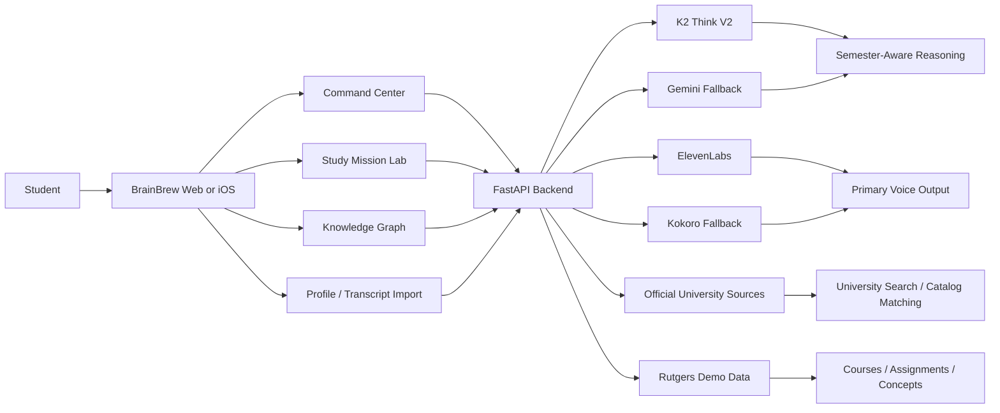

# BrainBrew

<div align="center">
  
</div>

<div align="center">

### Rutgers-First Academic Mission Control

BrainBrew turns a fragmented semester into a reasoning system.

[](#)
[](#ai-stack)
[](#demo-context)
[](#platforms)

</div>

---

## Overview

Students rarely fail because information is unavailable.

They fail because the semester is fragmented across:
- course pages
- assignments
- notes
- syllabi
- deadlines
- mental overhead

BrainBrew is the layer above that chaos. It helps a student understand:
- what matters now
- what is actually at risk
- which concept gaps are causing the risk
- what study action to take next

This is not a generic study chatbot. It is an academic workflow system built around reasoning, triage, and intervention.

---

## What BrainBrew Does

### Command Center
- surfaces urgent work across the semester
- flags at-risk assignments
- shows readiness and remediation paths

### Knowledge Graph
- maps concepts across courses
- exposes weak areas before exams make them obvious
- connects assignment risk back to missing understanding

### Study Mission Lab
- generates quizzes, flashcards, and study guides
- grounds outputs in course context instead of generic prompts
- supports read-aloud and voice interaction

### University + Transcript Ingestion
- searches universities
- pulls official university metadata
- imports transcripts
- matches coursework against official catalogs

---

## Why It Feels Different

Most academic AI tools stop at chat, summaries, or note cleanup.

BrainBrew goes further by reasoning over:
- the student’s current courses
- upcoming deadlines
- remediation state
- concept mastery
- imported academic history

The result is a product that behaves more like academic mission control than a single assistant window.

---

## AI Stack

### Primary Reasoning
- `K2 Think V2`

Used for:
- semester-aware chat
- study guide generation
- flashcard generation
- quiz generation
- concept extraction
- topic-level academic reasoning

### Fallback Inference
- `Google Gemini`

Used when K2 is unavailable during generation flows.

### Voice Stack
- `ElevenLabs` for primary text-to-speech
- `Kokoro-82M` as fallback TTS
- backend speech transcription via `ElevenLabs`

---

## Platforms

### Web
- `React`
- `TypeScript`
- `Vite`
- `Zustand`
- `Framer Motion`

### Backend
- `Python`
- `FastAPI`
- `Uvicorn`

### iOS
- `Swift`
- `SwiftUI`
- `AVFoundation`

---

## Demo Context

The default experience is built around a realistic Rutgers M.S. in Computer Science semester:
- `16:198:513` Design and Analysis of Data Structures and Algorithms
- `16:198:518` Operating Systems Design
- `16:198:533` Natural Language Processing
- `16:198:536` Machine Learning

This gives the product a credible, high-context demo environment across algorithms, systems, NLP, and ML.

---

## Architecture



---

## Deployment

Production targets:
- Web: `https://brain-brew.us`
- API: `https://api.brain-brew.us`

Hosted on:
- `Render`

Domain managed on:
- `Porkbun`

---

## Local Development

### Backend

Create `backend/.env`:

```env
K2_API_KEY=your_k2_key_here
ENABLE_GEMINI_FALLBACK=true
GEMINI_API_KEY=your_gemini_key_here
ELEVENLABS_API_KEY=your_elevenlabs_key_here
ELEVENLABS_VOICE_ID=21m00Tcm4TlvDq8ikWAM
ELEVENLABS_TTS_MODEL=eleven_turbo_v2_5
KOKORO_VOICE=af_heart
KOKORO_LANG_CODE=a
KOKORO_SPEED=1.0
HF_TOKEN=your_huggingface_token_here
```

Run:

```bash
cd backend
pip install -r requirements.txt
python run.py
```

### Frontend

Create `frontend/.env` if needed:

```env
VITE_API_BASE_URL=http://localhost:8000/api
```

Run:

```bash
cd frontend
npm install
npm run dev
```

### iOS

See [IOS_APP/README.md](./IOS_APP/README.md).

---

## Team

- Varesh Patel
- Aparajita Sarkar
- Sinchana S Arun

Built for HackPrinceton 2026.

---

## One-Line Summary

**BrainBrew turns academic chaos into a system that can reason, prioritize, and respond.**
